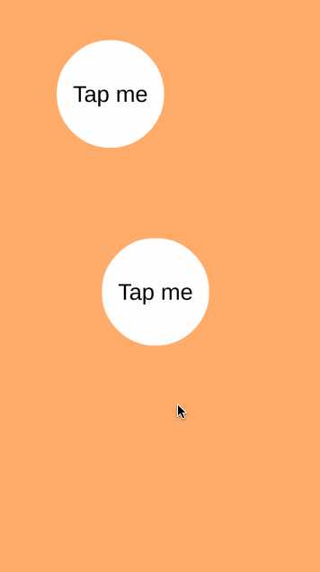
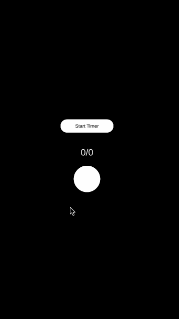
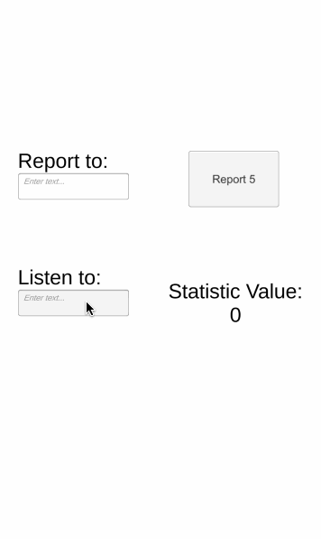

# Muestra de Sistemas y Utilities - 2020

Muestra de algunos sistemas y herramientas que he desarrollado para proyectos personales desarrollados en Unity con C# durante el último año.

Los sistemas incluidos en este repositorio son:

-**Audio | Sfx Controller**: Sistema que permite controlar efectos de sonido. Cada efecto está definido por un Scriptable Object el cual permite agregar variacione,
especificar el volumen y agregar un rango variante de pitch.

-**Audio | Music Controller**: Sistema básico para manejo de música. Este sistema cuenta con un Scriptable Object que posee la lista de pistas que estarán disponibles.
Cada pista es un ScriptableObject que permite asignar un id, el clip a reproducir, el volumen máximo y la duración de fades.

-**Input**: Sistema que permite realizar interacciones como Tap y Drag en objetos del mundo. Este sistema implementa los EventSystems de Unity y por medio de raycast
o circle cast interactúa con objetos en el mundo que implementen las interfaces respectivas.

-**Timers**: Sistema para controlar timers corriendo en tiempo real. Cada timer posee un identificador único y notifica sus cambios de estado haciendo sencilo
poder trabajar con ellos desde cualquier lugar. Cada timer notifica cuando ha sido completado, alterado y también cada frame de actualización.

-**UI Controller**: Sistema para controlar el flujo de UI. Hace que la pantalla activa se presente sobre todos los demás elementos de UI y permite que cada pantalla 
tenga distintos comportamientos al perder y recibir el foco. Adeás cuenta con un utility llamado UITweener que hace uso de DoTween para poder agregarle animaciones
de entrada y salida con mucha facilidad sin necesidad de agregarlas desde código o usando el Animator haciendo que tenga un mejor rendimiento.

-**Statistics Controller** Sistema que permite reportar progreso de estadísticas de juego y notifica cuando los valores han sido modificados.. Es muy útil para hacer sistemas de achievements, misiones, etc. 

-**Main Execution**: Este es un sistema que permite controlar el orden en que se van a inicializar los controladores que implementen alguna de las interfaces necesarias.
Cuenta con tres fases PreInitialize, Load e Initialize. Se ejecutan en ese orden específico y permiten que componentes carguen incluso cuando tengan que hacer algún
proceso largo ya que lo hace a través de corutinas que esperan a que los procesos del componente anterior hayan terminado.

-**System Connector**: Es parte de una arquitectura basada en Scriptable Objects. Este Scriptable Object es el encargado de comunicar sistemas con objetos externos.
Al ser un Scriptable Object, permite que sea referenciado por cualquier MonoBehaviour sin necesidad de estar en la misma escena en la que está el sistema, haciendo
sencillo conectar múltiples escenas sin necesidad de usar Singletons.

## Escenas de muestra

Hay tres escenas de muestra donde se puede probar el funcionamiento de algunos de estos sistemas y componentes.

-**Input And Tweens Example**: Muestra el funcionamiento del Input Tap sobre un objeto en la escena que al recibir el evento ejecuta una animación basada en Tweens.

-**Timers Example**: Permite iniciar un timer y muestra en pantalla el progreso de este suscribiéndose a su evento Update. 

-**UI Controller Example**: Muestra el funcionamiento del sistema UIController. Permite abrir una pantalla con un boton y depués abrir una segunda pantalla provocando
que la primera se oculte. Hace uso de UITweener para hacer transiciones smooth entre una otra pantalla.

-**Statistics Example**: Muestra el funcionamiento del sistema StatisticsController. Permite escribir en un input field el Id de una estadística para reportar un nuevo valor y peremite escribir el Id de una estadística para escuchar a su balor. En un texto muestra el valor de la estadística que se está escuchando y lo actualiza en el momento que recibe cambios.

   

